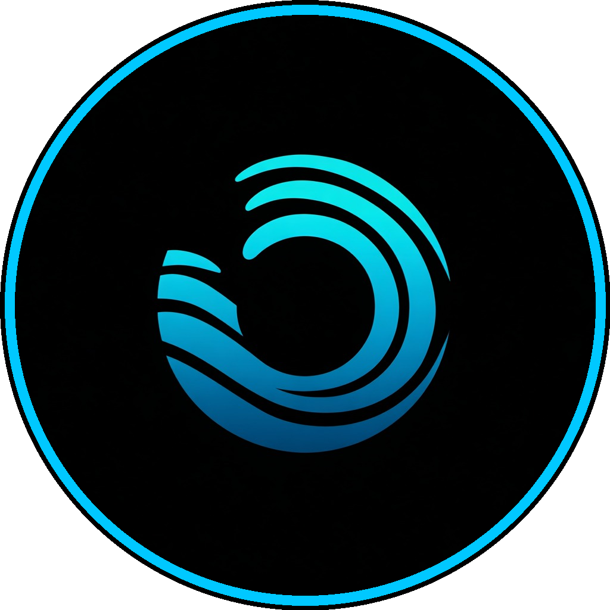
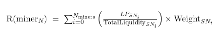
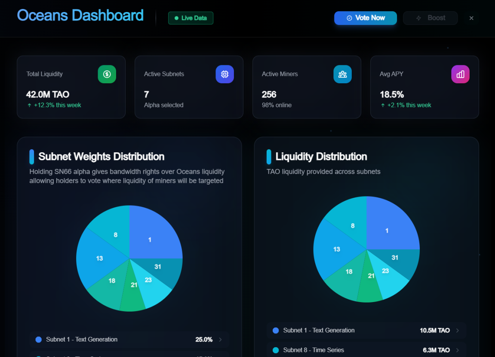

<picture>
  <source srcset="image.png" media="(prefers-color-scheme: dark)">
  <source srcset="image.png" media="(prefers-color-scheme: light)">
  
</picture>

# **Oceans Subnet 66** <!-- omit in toc -->

🌐 [Website](https://oceans66.com) • ⛏️ [Mining Guide](docs/miner.md) • 🧑‍🏫 [Validator Guide](docs/validator.md)

---
## 📋 Overview

Ocean is on a mission to transform **bittensor pools** into **oceans**. We will use bittensor incentives to channel **liquidity** to where it is most productive. Subnet liquidity has been a huge issue in **Bittensor** and we want to solve it.

- **Holders of sn66 alpha** will be able to vote (with their vote relevance determined by their sn66 α-Stake) and decide to which bittensor subnet miners should provide liquidity to.
- **Miners of sn66** will provide liquidity to bittensor subnets and will be rewarded depending on the amount of liquidity provided and the weight of each subnet determined by the votes of the sn66 holders

**📊 Liquidity Amount**  
How much liquidity they provide to the pools, measured as the total value in USD of their positions

**🎯 Pool Selection**  
Whether the pools they supply were selected by the α-Stake voting of the holders 

The result is an incentivized system that continually redirects liquidity toward the pools most valued by the community.

## 🔄 Incentive Mechanism

Oceans goal is to incentive miners to provide liquidity where the community decides. That is the core idea of the incentive mechanism, which will be implemented in the following way:

### 1. Voting
Holders continuously vote. A resulting subnet weights vector is created. It can be fetched, it is public and ready for audit.

### 2. LP
Miners fetch the current subnet weights vector and decide where to provide liquidity. Miners have to decide which subnets are better based on its weights and the current market situation. α-Stake votes will route the emissions, but miners are the ones ultimately deciding.

### 3. Reward Formula
Every epoch, the subnet measures the total liquidity provided by the miners, and distributes incentives based on the liquidity provided and the weights holders voted.

  

## 🔧 Voting Mechanism

Sn66 alpha works as a **governance token** where holders vote which subnets they want miners to provide liquidity to. This alpha token will be valuable as it can be used to increase liquidity in the targeted pools providing **price stability** and reduced **slippage**. 

In the v0, holders will vote on which subnets pools they want liquidity to be provided. In upcoming versions holders will be also able to also decide more specific details like **price ranges** (Uniswap V3).

### Voting Flow

In the v0 of the Oceans website sn-66 α-Stake holders will:
1. Change their subnet weights allocation (referred to as votes previously)
2. Track other people weights (votes will be public)
3. See current global weights (Where holders want miners to provide liquidity to)
4. Monitor current miners liquidity flow (where are miners actually providing liquidity)

### Example UI Image

  

### Full Transparency
Because the votes are public in the v0, anyone can reproduce them and verify that the weight allocation was correct.

### Future Decentralization into Smart Contract
Moving towards fully decentralized governance is a core priority for Ocean Subnet. By transitioning voting mechanisms to smart contracts, we eliminate centralized points of failure and ensure complete transparency and immutability of the governance process.

## 💳 Utility Model

Sn66 alpha is a governance token that can be seen as **"bandwidth rights"** of Sn66 commodity. Sn66 commodity is liquidity and so the holders of sn66 alpha can decide where this liquidity flow. 

Ocean Subnet does not generate fees, it creates a valuable **commodity** as it is liquidity. **Buy pressure** will come from people who want to dispose and consume this commodity.

The more liquidity miners provide the more valuable this commodity will be the more buy pressure will exists. Miners will optimize the liquidity allocation based on holders desires and will **compete** between each other to provide the most liquidity possible.

## 🚀 Liquidity Boosts
We will add **gamification** to the subnet and allow holders to requests time limited **liquidity boosts** in exchange of burning ("paying") some sn66 alpha.

## 🗺️ Roadmap

| Version | Timing | Features |
|---------|--------|----------|
| **v0** | July 2025 | • Off-chain web voting by α-Stake holders • Validators fetch votes off-chain & fetch liquidity on-chain to determine weights |
| **v0.1** | Q4 2025 | • Rich analytics dashboard for vote & liquidity transparency |
| **v0.2** | Q1 2026 | • Migrate α-Stake voting from web UI to fully on-chain smart contracts • Validators become light verifiers of on-chain data only |
| **v0.3** | Q2 2026 | • Introduce burn-based bounty mechanism (SN α → pool premium) • Burned SN α temporarily augments stake-consensus weight for selected pools • UI & validator support for bounty tracking and decay timers |

> **ℹ️ Toward Full Decentralization:** Moving voting logic **on-chain** eliminates the need for validators to fetch and mirror off-chain votes, reducing **trust assumptions** and completing the governance loop entirely within the blockchain.
